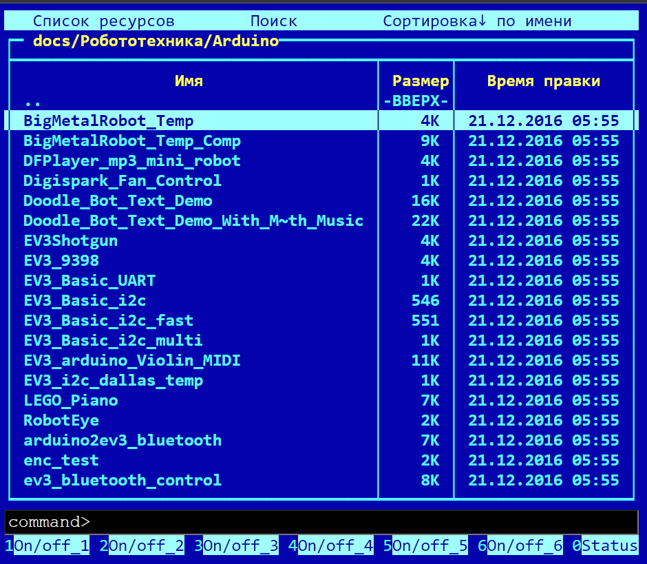

# OfflineStoraExplorerUI

Frontend на Vue для сервиса по оффлайновому просмотру файловых систем отмонтированных сетевых хранилищ

Реализованы:

- отображение сетевых ресурсов из базы данных в стиле Norton/Midnight Commander
- сортировка по имени, размеру, дате
- поиск по имени
- включение/выключение физических дисков (посредтсвом команды на backend, которая далее преобразуется в shell-команду)
